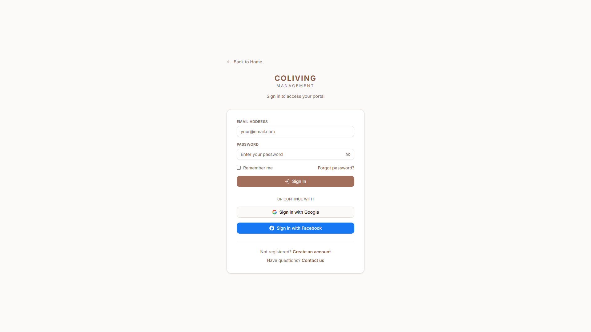
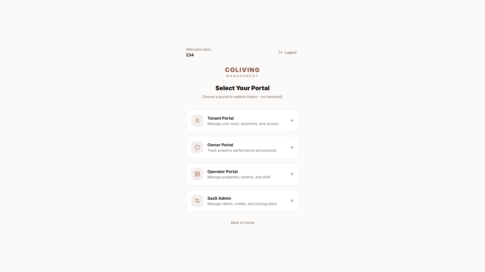
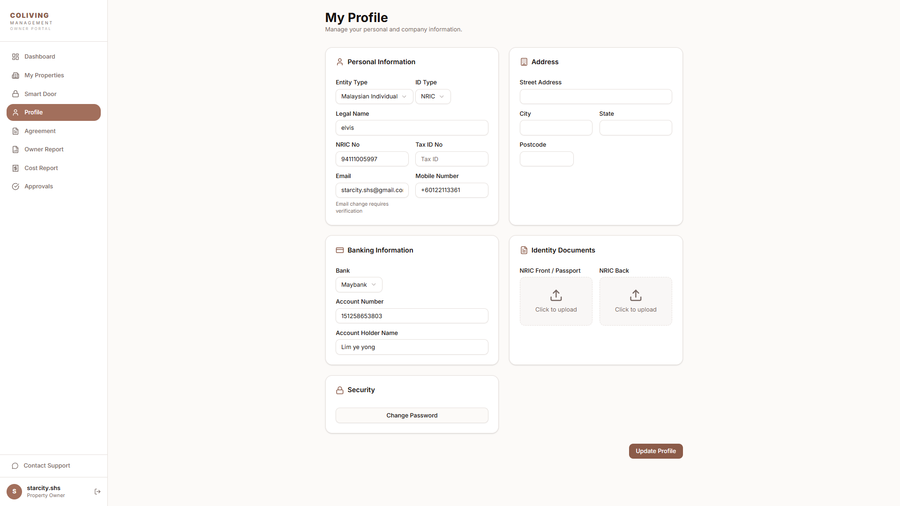
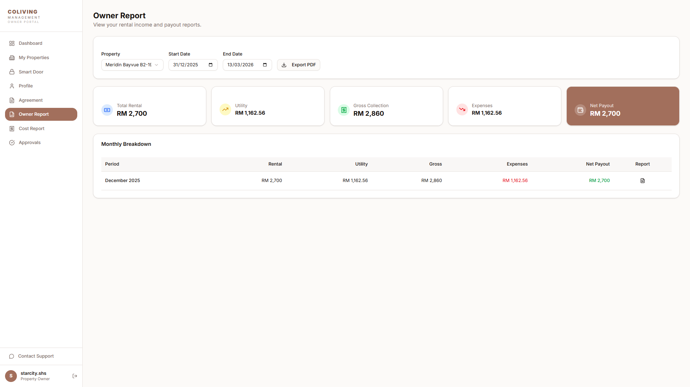
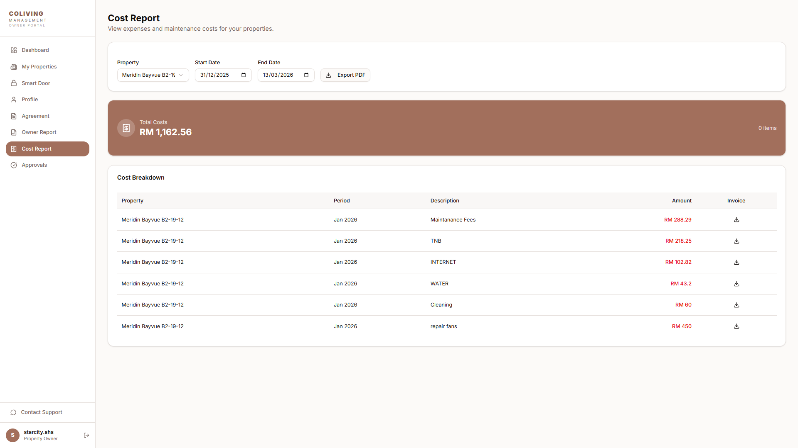

# Owner Portal — Step-by-Step Manual

**English · For property owners**

This manual explains how to use the **Owner Portal** to view your properties, complete your profile, sign agreements, and download reports. Follow the steps in order. Where you see **\[SCREENSHOT: …]**, insert a screenshot of that screen for your own documentation or training.

---

## What you need before you start

- An **invitation** from your operator (management company) linking your **email** to one or more properties.
- Your **login** to the platform (Wix or Portal, as provided by the operator).
- A **browser** (Chrome, Safari, or Edge recommended).

---

## Overview: What the Owner Portal does

| Area | What you can do |
|------|------------------|
| **My Property** | See your properties and units; view tenancies (who is renting, period, rent). |
| **Profile** | Update your name, phone, address, bank details, NRIC (ID); upload NRIC front/back. |
| **My Agreement** | View and sign agreements (owner–operator, owner–tenant); complete e-signature. |
| **My Report** | Select a property and period; view Owner Report; **download PDF**. |
| **Cost / Support** | View cost reports; download Cost PDF; contact support. |

**Important:** Complete your **Profile** first. Until your profile is complete, the portal may only allow you to open the Profile section.

---

## Part 1 — Log in and open the Owner Portal

### Step 1.1 — Open the login page

**What you do:** Go to the URL your operator gave you (e.g. your building’s website or portal link) and open the **Owner** or **Owner Portal** page.

**What you see:** A login screen (email + password, or “Log in with Google”, etc., depending on how your operator set it up).

> 
> *Login: email, password, Log in.*

---

### Step 1.2 — Log in

**What you do:** Enter your **email** and **password**, then click **Log in** (or equivalent).

**What you see:** After a short loading, you are taken to the main Owner Portal screen. You may see a row of buttons or tabs such as: **My Property**, **Profile**, **My Agreement**, **My Report**, **Support**.

> 
> *Dashboard: sidebar with My Properties, Profile, Agreement, Report, Cost, Approvals, Contact Support.*

---

## Part 2 — Complete your Profile (do this first)

### Step 2.1 — Open Profile

**What you do:** Click the **Profile** (or **My Profile**) button or tab.

**What you see:** The Profile section opens. You see fields for: name, phone, address, bank details (e.g. bank name, account number), and sometimes NRIC (ID) and upload areas for NRIC front/back.

> 
> *Profile: name, phone, address, bank, NRIC, Save.*

---

### Step 2.2 — Fill in your details

**What you do:**  
- Enter or correct your **full name**, **phone number**, and **address**.  
- Select your **bank** from the dropdown (if shown) and enter your **bank account number**.  
- If NRIC (ID) is required, enter the number and upload **front** and **back** photos of your ID using the upload buttons.

**What you see:** Fields update as you type. After uploading, you may see a preview or a “Uploaded” message next to NRIC.

**Tip:** NRIC uploads are stored securely. Use clear, readable photos without glare.

> *(Same page: bank dropdown and NRIC upload are on the Profile page.)*

---

### Step 2.3 — Save your profile

**What you do:** Click **Save** or **Update** (or equivalent) at the bottom of the Profile form.

**What you see:** A short loading, then a success message (e.g. “Profile updated”). Other menu items (My Property, My Agreement, My Report) may become available after the profile is complete.

> *(After Save you may see a success message; other menu items stay in the sidebar.)*

---

## Part 3 — View your properties and tenancies

### Step 3.1 — Open My Property

**What you do:** Click **My Property** (or **Property**) in the main menu.

**What you see:** The Property section opens. You may see:  
- A **dropdown to select a property** (if you have more than one).  
- A **dropdown to select operator** (if you have multiple management companies).  
- A **list of tenancies**: unit/room, tenant name, period (start–end), rent amount.

> 
> *My Properties: property list and tenancy list (room, tenant, period, rent).*

---

### Step 3.2 — Change property (if you have several)

**What you do:** If you have more than one property, choose the property from the **Property** dropdown.

**What you see:** The tenancy list updates to show only units and tenants for the selected property.

---

## Part 4 — Sign agreements (My Agreement)

### Step 4.1 — Open My Agreement

**What you do:** Click **My Agreement** (or **Agreement**) in the main menu.

**What you see:** A list of agreements that need your action or that you can view. Each row may show: agreement title, property, status (e.g. Pending / Ready to sign / Signed), and a **View** or **Sign** button.

> 
> *Agreement: list (View/Sign) or document with signature area.*

---

### Step 4.2 — Open an agreement to sign

**What you do:** Click **View** or **Sign** on the agreement you want to complete.

**What you see:** The agreement content opens (often as a document or HTML view). You see the full text of the agreement (owner–operator or owner–tenant). At the bottom there is usually a **signature** area and a **Sign** or **Agree** button.

> *(Open an agreement to see the document and Sign/Agree.)*

---

### Step 4.3 — Sign the agreement

**What you do:**  
- Enter your **signature** (type your name or draw in the signature box, depending on the page).  
- Click **Sign** or **Agree** (or **Submit**).

**What you see:** A short loading. Then a confirmation (e.g. “Agreement signed”) and the status of the agreement may change to “Signed” or “Completed”. You can return to the agreement list.

> *(After signing: confirmation and status “Signed”.)*

---

## Part 5 — View and download reports (My Report)

### Step 5.1 — Open My Report

**What you do:** Click **My Report** (or **Report**) in the main menu.

**What you see:** A **Report** submenu or section. You may see:  
- A **property dropdown** to choose which property’s report to view.  
- A **period** or **date range** selector.  
- A **table** or summary: rental income, expenses, management fee, net payout, etc.  
- A button such as **Export PDF** or **Download PDF**.

> 
> *Owner Report: property, period, table, Export PDF.*

---

### Step 5.2 — Select property and period

**What you do:**  
- Select the **property** from the dropdown.  
- Select or enter the **period** (e.g. month/year or date range) for the report.

**What you see:** The table updates to show the figures for that property and period (e.g. Gross Income, Expenses, Management Fee, Net Payout).

---

### Step 5.3 — Download the Owner Report PDF

**What you do:** Click **Export PDF** or **Download PDF** (or similar).

**What you see:** The browser starts downloading a PDF file. The file is the **Owner Report** for the selected property and period (same data as on screen, in PDF form).

**Tip:** If the button is disabled, check that you have selected both property and period and that data exists for that period.

> *(Export PDF is on the same Report page.)*

---

## Part 6 — Cost report and support

### Step 6.1 — Open Cost report (if available)

**What you do:** Click **Cost** or **Cost Report** (or find it under the Report submenu).

**What you see:** A cost report section: list or table of costs for your property/properties, and often a **Download Cost PDF** or **Export Cost PDF** button.

> 
> *Cost Report: cost list and Download PDF.*

---

### Step 6.2 — Download Cost PDF

**What you do:** Click **Export PDF** or **Download Cost PDF**.

**What you see:** A PDF file downloads with the cost report for the selected scope (property/period).

---

### Step 6.3 — Support

**What you do:** Click **Support** (or **Contact**) if you need help.

**What you see:** Contact details, a contact form, or a link to the operator’s support (depending on how the operator configured the portal).

> *(Contact Support is in the sidebar on every page.)*

---

## Quick reference — Owner Portal

1. **Log in** — Owner / Portal login page  
2. **Complete Profile** (name, phone, bank, NRIC) — Profile section  
3. **View properties and tenancies** — My Property  
4. **Sign agreements** — My Agreement → View/Sign → Sign  
5. **View report and download PDF** — My Report → select property & period → Export PDF  
6. **Cost report PDF / Support** — Cost section → Export; Support section  

---

## Troubleshooting

| Problem | What to try |
|---------|-------------|
| Cannot log in | Check email and password; use “Forgot password” if available; contact operator. |
| Profile “Save” does nothing | Ensure required fields are filled; check for error messages; try another browser. |
| NRIC upload fails | Use a clear image (JPG/PNG); size within limit; try again. |
| No agreements in list | Your operator may not have sent any yet; contact them to create an agreement for your property. |
| Export PDF disabled | Select both property and period; ensure there is data for that period. |
| Menu items greyed out | Complete Profile first; refresh the page and log in again. |

---

*Manual version: 1.0. For the Coliving SaaS Property Management platform. Replace each [SCREENSHOT: …] with a real screenshot of your Owner Portal for training or handover.*
