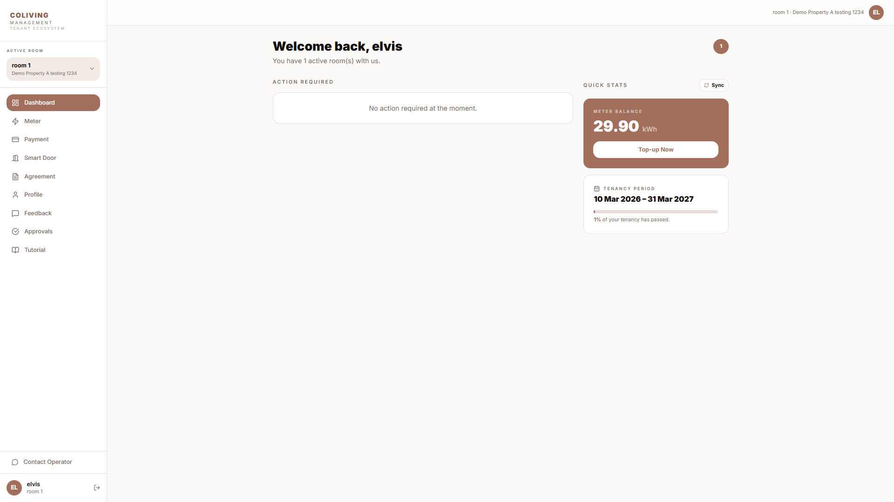
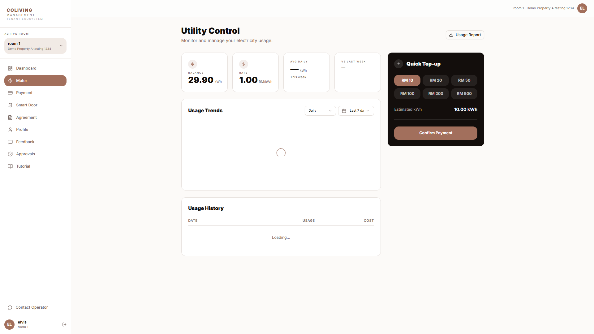
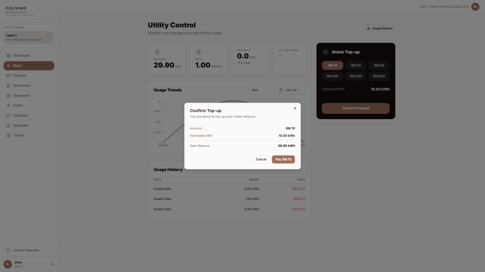

# Tenant Dashboard — Step-by-Step Manual

**English · For tenants (renters)**

This manual explains how to use the **Tenant Dashboard** to complete your profile, approve the operator, sign your tenancy agreement, pay rent and invoices, check meter usage, use the smart door, and submit feedback. Follow the steps in order. Where you see **\[SCREENSHOT: …]**, insert a screenshot of that screen for your own documentation or training.

---

## What you need before you start

- An **email address** that the operator (management company) has registered for you as a tenant.
- Your **login** (Wix or Portal, as provided by the operator).
- A **browser** (Chrome, Safari, or Edge recommended). For smart door (Bluetooth), use a supported device as advised by the operator.

---

## Overview: What the Tenant Dashboard does

| Area | What you can do |
|------|------------------|
| **Profile** | Enter or update name, phone, address, bank details, NRIC; upload NRIC front/back. **Do this first.** |
| **Approve & Agreement** | Approve the operator (if required); view and sign your tenancy agreement. |
| **Property** | Select which property/unit you are viewing (if you have more than one). |
| **Meter** | View electricity/utility usage; top up (if prepaid). |
| **Smart Door** | See door/lock status; open door (e.g. Bluetooth or passcode). |
| **Payment** | Pay rent or invoices (Stripe Checkout). |
| **Feedback** | Submit feedback with text, photos, or video. |

**Important:**  
- Complete your **Profile** first. Until it is complete, you may only be able to open the Profile section.  
- If you have **unsigned agreements**, you must sign them before using Meter, Smart Door, or Payment.  
- If you have **unpaid rent**, Meter and Smart Door may be disabled until rent is paid.

---

## Part 1 — Log in and open the Tenant Dashboard

### Step 1.1 — Open the login page

**What you do:** Go to the URL your operator gave you (e.g. tenant portal or building website) and open the **Tenant** or **Tenant Dashboard** (or **Log in**) page.

**What you see:** A login screen: email + password, or “Log in with Google” / “Log in with Facebook”, depending on setup.

> 
> *Place a screenshot here showing the login form (email, password, Log in button).*

---

### Step 1.2 — Log in

**What you do:** Enter your **email** and **password**, then click **Log in**.

**What you see:** A short loading. Then the main Tenant Dashboard. You may see a **default view** with cards or buttons: **Profile**, **Agreement**, **Meter**, **Smart Door**, **Payment**, **Feedback**. Some buttons may be greyed out until you complete profile and agreements.

> 
> *Place a screenshot here showing the main dashboard with all section buttons (Profile, Agreement, Meter, Smart Door, Payment, Feedback).*

---

## Part 2 — Complete your Profile (do this first)

### Step 2.1 — Open Profile

**What you do:** Click the **Profile** button or tab.

**What you see:** The Profile section opens with fields for: full name, phone, address, bank (dropdown + account number), NRIC number, and **upload areas for NRIC front** and **NRIC back**.

> 
> *Place a screenshot here showing the profile form and the two NRIC upload buttons.*

---

### Step 2.2 — Fill in your details

**What you do:**  
- Enter or correct **full name**, **phone**, **address**.  
- Select **bank** from the dropdown and enter **account number**.  
- Enter **NRIC** (ID) number.  
- Click **Upload** for NRIC front and NRIC back, and select clear photos of your ID (both sides).

**What you see:** Fields update as you type. After upload, you may see a thumbnail or “Uploaded” next to each NRIC field.

**Tip:** Use clear, readable photos; avoid glare. Accepted formats are usually JPG/PNG.

> 
> *Place a screenshot here showing bank selection and NRIC upload areas with “Uploaded” or preview.*

---

### Step 2.3 — Save your profile

**What you do:** Click **Save** or **Update** at the bottom of the Profile form.

**What you see:** Loading, then a success message. After profile is complete, the **Approve** (operator) and **Agreement** options become available.

> 
> *Place a screenshot here showing the success message.*

---

## Part 3 — Approve operator and sign agreement

### Step 3.1 — Approve the operator (if shown)

**What you do:** On the main dashboard, if you see an item like **“Approve client”** or **“Approve operator”** in a repeater/card list, click it.

**What you see:** A confirmation step or screen. After you confirm, the system links you to the operator so you can receive and sign your tenancy agreement.

> 
> *Place a screenshot here showing the approve button on the dashboard.*

---

### Step 3.2 — Open My Agreement

**What you do:** Click the **Agreement** (or **My Agreement**) button.

**What you see:** A list of agreements. You may see one or more **pending** agreements (e.g. “Tenant–Operator” or “Tenant Agreement”) with a **View** or **Sign** button. You may also see a **Property** dropdown if you have more than one unit.

> 
> *Place a screenshot here showing the agreement list with at least one pending agreement and action button.*

---

### Step 3.3 — Open the agreement to sign

**What you do:** Click **View** or **Sign** on the agreement you need to sign.

**What you see:** The agreement content opens (document or HTML). You can scroll through the full text. At the bottom there is a **signature** area and a **Sign** or **Agree** button.

> 
> *Place a screenshot here showing the agreement text and the signature input + Sign/Agree button.*

---

### Step 3.4 — Sign the agreement

**What you do:**  
- Enter your **signature** (type your name or draw in the box, as the page allows).  
- Click **Sign** or **Agree**.

**What you see:** Loading, then a success message. The agreement status becomes “Signed” or “Completed”. You can go back to the dashboard; **Meter**, **Smart Door**, and **Payment** will now be available (unless rent is unpaid—see Part 5).

> 
> *Place a screenshot here showing the success message or the agreement list with “Signed” status.*

---

## Part 4 — Select property and view Meter

### Step 4.1 — Select property (if you have more than one)

**What you do:** On the main dashboard, use the **Property** dropdown to select the property/unit you want to view (meter, door, payments).

**What you see:** The dropdown lists your properties/units. After selection, data for Meter, Smart Door, and Payment is for that property only.

**Note:** If you have **unpaid rent** for the selected property, Meter and Smart Door buttons may be **disabled** until you pay.

> 
> *Place a screenshot here showing the property dropdown and the main buttons (Meter, Smart Door, Payment).*

---

### Step 4.2 — Open Meter

**What you do:** Click the **Meter** button.

**What you see:** The Meter section opens. You may see:  
- **Usage summary** (e.g. current period usage, balance).  
- **Meter group** or **room meter** details.  
- A **Top-up** button (if your meter is prepaid).  
- For postpaid meters, you may see “Postpaid” and no top-up.

> 
> *Place a screenshot here showing the meter view: usage, balance, and Top-up (or “Postpaid”) button.*

---

### Step 4.3 — Top up meter (if prepaid)

**What you do:** Click **Top-up**. Enter the amount (or select a package) and confirm. You will be redirected to **payment** (Stripe Checkout). Complete the payment in the new tab/window.

**What you see:** After payment, you return to the dashboard or meter page. The meter balance or status updates (may take a short moment).

**Tip:** If the button shows “Postpaid Mode”, your unit is on postpaid billing; no top-up is needed here.

> 
> *Place a screenshot here showing the top-up amount or package selection before payment.*

---

### Step 4.4 — Close Meter and return

**What you do:** Click **Close** or the back arrow (or **Dashboard**) to return to the main dashboard.

**What you see:** You are back on the main Tenant Dashboard view.

---

## Part 5 — Smart Door (lock)

### Step 5.1 — Open Smart Door

**What you do:** Click the **Smart Door** button.

**What you see:** The Smart Door section. You may see:  
- Your **room/unit name** and lock status.  
- Buttons such as **Open door** (Bluetooth) or **Passcode**.  
- Battery level or last sync (if shown).

> 
> *Place a screenshot here showing the smart door section with the open/passcode buttons.*

---

### Step 5.2 — Open the door (Bluetooth)

**What you do:** Click **Open door** or **Bluetooth** (or similar). Allow the browser/device to use Bluetooth if prompted. Follow the on-screen steps (e.g. “Opening…” then “Door open”).

**What you see:** A short loading (“Opening…”). Then a message like “Door open”. The door unlocks for a short time.

**Note:** Bluetooth unlock works only when you are near the lock with a supported device.

> 
> *Place a screenshot here showing the opening/door open state.*

---

### Step 5.3 — Close Smart Door and return

**What you do:** Click **Close** or back to return to the main dashboard.

**What you see:** You are back on the main Tenant Dashboard.

---

## Part 6 — Pay rent or invoices (Payment)

### Step 6.1 — Open Payment

**What you do:** Click the **Payment** button.

**What you see:** The Payment section. You may see:  
- A list of **invoices** or **rent items** (description, amount, due date, paid/unpaid).  
- A **Pay now** or **Pay** button for selected or all unpaid items (often up to 10 at a time).

> 
> *Place a screenshot here showing the list of invoices/rent and the Pay now button.*

---

### Step 6.2 — Pay selected invoices

**What you do:** Select the invoice(s) you want to pay (if there is a checkbox), then click **Pay now** (or **Pay**).

**What you see:** You are redirected to **Stripe Checkout** (payment page). Enter card details and complete the payment. After success, you are redirected back to the Tenant Dashboard or Payment section. The paid items show as “Paid” or disappear from the unpaid list.

**Tip:** Keep the tab open until you see the success page; do not close the payment window before completing.

> 
> *Place a screenshot here showing the payment list with some items marked “Paid” or the success message.*

---

### Step 6.3 — Return to dashboard

**What you do:** Click **Close** or back to return to the main dashboard.

**What you see:** Once rent is paid, **Meter** and **Smart Door** (for that property) become available again if they were disabled.

---

## Part 7 — Submit feedback

### Step 7.1 — Open Feedback

**What you do:** Click the **Feedback** button.

**What you see:** The Feedback section. You see:  
- A **description** or **message** text box.  
- **Upload** buttons for **photo** and **video** (optional).  
- A **Submit** button.

> 
> *Place a screenshot here showing the feedback form: description field, photo/video upload, Submit button.*

---

### Step 7.2 — Write and attach files, then submit

**What you do:**  
- Type your **message** in the description box.  
- Optionally click **Upload** for photo and/or video and select files.  
- Click **Submit** (or **Send feedback**).

**What you see:** Loading, then a success message (e.g. “Feedback submitted”). The form may clear so you can send another feedback if needed.

> 
> *Place a screenshot here showing the success message after submit.*

---

## Quick reference — Tenant Dashboard

| Step | Action | Where |
|------|--------|--------|
| 1 | Log in | Tenant / Portal login page |
| 2 | Complete Profile (name, phone, bank, NRIC) | Profile section |
| 3 | Approve operator (if shown) | Main dashboard repeater |
| 4 | Sign tenancy agreement | Agreement → View/Sign → Sign |
| 5 | Select property | Property dropdown on main view |
| 6 | View usage / top up meter | Meter section → Top-up (if prepaid) |
| 7 | Open door | Smart Door → Open door / Bluetooth |
| 8 | Pay rent or invoices | Payment → select items → Pay now |
| 9 | Send feedback | Feedback → type message, upload, Submit |

---

## Troubleshooting

| Problem | What to try |
|---------|-------------|
| Cannot log in | Check email and password; use “Forgot password” if available; contact operator. |
| Profile required / buttons greyed out | Complete Profile first; then sign Agreement. |
| Meter / Smart Door disabled | Complete profile and agreement; pay any unpaid rent for the selected property. |
| Agreement not showing | Operator may not have created it yet; contact them. |
| Top-up says “Postpaid” | Your unit is on postpaid; no top-up needed; billing is handled by operator. |
| Payment page does not open | Check pop-up blocker; allow redirect to Stripe Checkout. |
| Bluetooth door open fails | Ensure you are near the lock; allow Bluetooth; use a supported device. |
| Feedback upload fails | Use supported format (e.g. JPG, PNG, MP4); check file size limit. |

---

*Manual version: 1.0. For the Coliving SaaS Property Management platform. Replace each [SCREENSHOT: …] with a real screenshot of your Tenant Dashboard for training or handover.*
